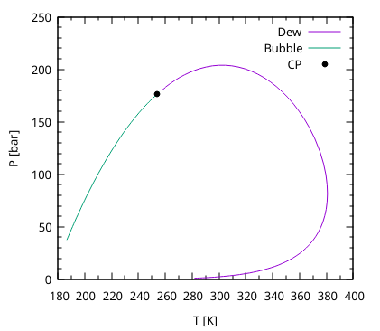

Phase Equilibria calculations are fundamental for the majority of EoS based
modelling either for processes or when studying phase-behaviour.

In `yaeos` most of phase-equilibria procedures return the `EquilibriumState`
type [[EquilibriumState]], which holds all the relevant information of an
equilibria point.

The implemented methods, and their usage are:

[TOC]

# Flash calculations
Flash calcuations are one of the most used phase-equilibria calculations during
modelling of processes.

In `yaeos` it is possible to make Flash calculations either specifying:

- \( zPT \rightarrow x, y, \beta (V) \)
- \( zVT \rightarrow x, y, \beta (P) \)

```fortran
type(EquilibriaState) :: result

! zPT flash
result = flash(model, z, p_spec=P, T=T)

! zVT flash
result = flash(model, z, v_spec=P, T=T)

! It is possible to provide initialization compositions in terms of the
! K-factors. Where k0=y/x
result = flash(model, z, v_spec=P, T=T, k0=k0)
```

It is also possible to make flash calculations with \(G^E\) models. In that
case, it is important to ignore the `v_spec` and `p_spec` arguments, and provide
an initial guess for \(K\)-values. A good way of estimating initial 
values is by using the `mintpd` subroutine. For example:

```fortran
integer, parameter :: nc = 3
type(UNIFAC) :: model
type(Groups) :: molecules(nc)
real(pr) :: n(nc), w(nc), T
type(EquilibriumState) :: fr
real(pr) :: mintpd
integer :: i


! Define the groups of the three molecules
molecules(1)%groups_ids = [1, 42]
molecules(1)%number_of_groups = [1, 1]

molecules(2)%groups_ids = [1, 2]
molecules(2)%number_of_groups = [2, 4]

molecules(3)%groups_ids = [16]
molecules(3)%number_of_groups = [1]

! Temperature
T = 250

! Moles
n = [0.2, 0.7, 0.1]

! setup UNIFAC model
model = setup_unifac(molecules)

! Find the composition that provides the mininum tpd
call min_tpd(model, n, P=1._pr, T=T, mintpd=mintpd, w=w)

! Calculate the phase-split flash
fr = flash(model, n, T, k0=w/n, iters=i)
```

# Saturation points
Single saturation point calculations are included with the procedures
[[saturation_pressure]] and [[saturation_temperature]]. Both procedures solve
the equation

\[
f(T \lor P) = \sum ln K_i - 1 = 0
\]

With a newton procedure with respect to the desired variable (either \(P\) or
\(T\), and updating the values of \(\ln K_i\) at each point with 
\(\frac{\ln \phi_i^y}{\ln \phi_i^z}\)

```fortran
type(EquilibriaState) :: sat_point

sat = saturation_pressure(model, z, T=T, kind="bubble")
sat = saturation_pressure(model, z, T=T, kind="dew")

sat = saturation_temperature(model, z, P=P, kind="bubble")
sat = saturation_temperature(model, z, P=P, kind="dew")
```

## Phase envelopes
Phase envelopes are the conection of all the saturation points of a system.
When the interest is in calculating a whole phase diagram instead of a single
point, or the point is hard to converge. It is better to use a robust
mathematical algorithm that eases the calcuation providing an easy-to-converge
point and using its information to initialize a next one and continue along the
whole phase-boundary.

In `yaeos` all kind of phase envelopes are calculated using the numerical 
continuation method. This method is extremely useful to calculate lines that
can be defined as a undertemined system \(F(\vec{X})=0\), which has one degree
of freedom left. This degree of freedom can be used to define an extra equation

\[
    X_{ns} - S = 0
\]

Where `ns` is the index of some specified variable from \(\vec{X}\), and \(S\)
is some specified value. Now the system \(F(\vec{X}, S) = 0\) has no degree
of freedom left and can be solved by traditional methods like Newton-Raphson.

When one point is solved, it is possible to determine how the vector of
variables change with respect to the specified variable by solving the following
system of equations:

\[
J \frac{\vec{\partial X}}{\partial S} + \frac{\partial F}{\partial S} = 0
\]

Knowing the sensitivities vector, \(\frac{\vec{\partial X}}{\partial S}\) we
can select the next variable to specify by selecting the one that has the
highest absolute value of \(\frac{\partial X_i}{\partial S}\). And a good 
extrapolation to calculate the next point can be obtained with

\[
X_{i+1} = X_{i} + \frac{\vec{\partial X}}{\partial S} \Delta S
\]

### Isopleths

```fortran
type(PTEnvel2) :: env

sat = saturation_pressure(model, z, T=150._pr, kind="bubble")
env = pt_envelope_2ph(model, z, sat)
```

